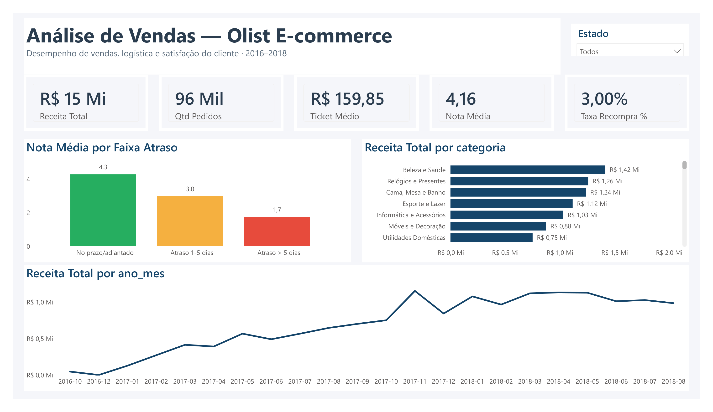
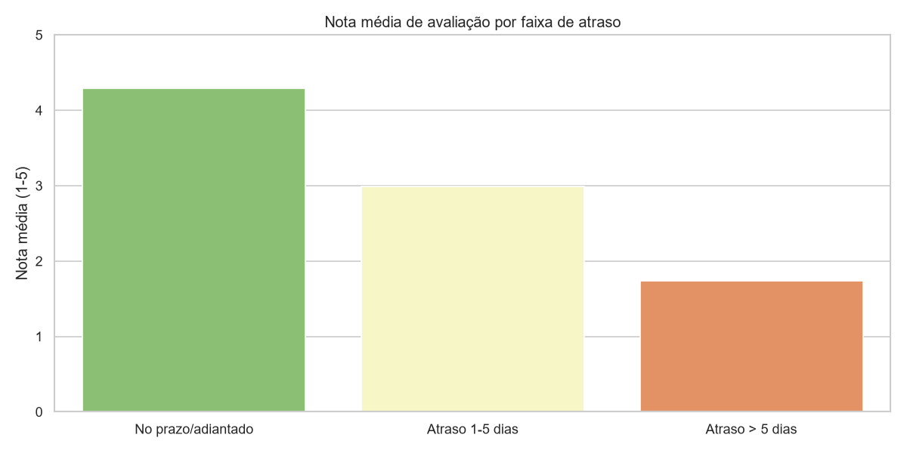
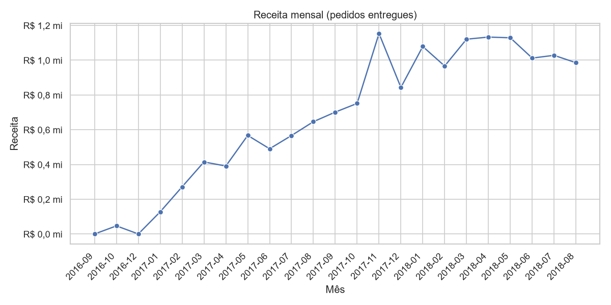
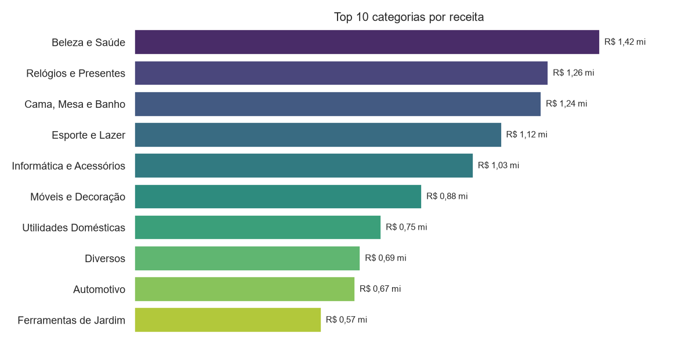
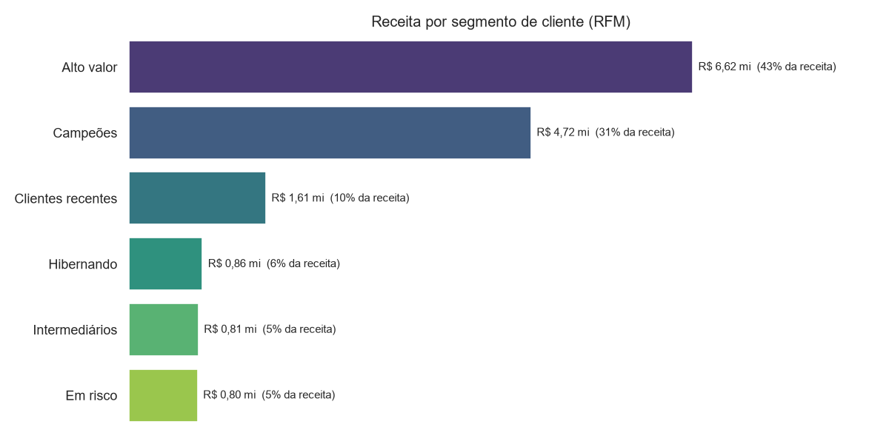

# Análise de Vendas — E-commerce Olist

Peguei a base pública da Olist, com quase 100 mil pedidos feitos entre 2017 e 2018, e fui atrás de
três coisas que qualquer loja online precisa entender: de onde vem o dinheiro, o que deixa o cliente
satisfeito (ou não) e por que ele volta — ou não volta — a comprar. Abaixo está o caminho que percorri,
o que encontrei e o que eu recomendaria a partir disso.

**Ferramentas:** SQL · Python (pandas) · Power BI



---

## Sobre o projeto

Montei esse projeto pra praticar o trabalho de analista de ponta a ponta, não só a parte de fazer
gráfico bonito. Queria pegar um dado bruto de verdade — com bagunça, volume e coisas pra arrumar — e
percorrer o caminho inteiro: limpar, organizar, analisar e chegar em conclusões que façam sentido pro
negócio.

Escolhi a base da Olist por dois motivos: são dados **reais** de um e-commerce brasileiro, com volume
de gente grande (~100 mil pedidos), e os problemas que aparecem ali (entrega, satisfação, recompra)
são os mesmos que praticamente qualquer varejo online enfrenta. Ou seja, dá pra tirar conclusão que
serviria numa empresa de verdade.

---

## O que eu quis responder

- De onde vem a receita? (por categoria e por região)
- Quanto vale um cliente? (ticket médio e quantos voltam a comprar)
- Entrega atrasada piora a avaliação do cliente?
- Como a receita se comporta ao longo do ano?

---

## Os dados

Usei o [Brazilian E-Commerce Public Dataset (Olist)](https://www.kaggle.com/datasets/olistbr/brazilian-ecommerce),
do Kaggle. São 9 tabelas que se conectam por chaves (pedido, item, pagamento, avaliação, cliente,
produto, vendedor, geolocalização e a tradução das categorias). O grão principal é o **pedido**, e foi
em torno dele que montei a base final.

Os CSVs não estão no repositório porque são pesados — pra reproduzir, é só baixar do Kaggle e colocar
em `data/raw/`.

---

## Como eu fiz

Optei por tratar tudo no Python **antes** de levar pro Power BI, em vez de ir "consertando" no visual.
Acho que é mais perto do que se faz no trabalho de verdade e deixa o dashboard mais leve. As decisões
principais foram:

- **Foquei nos pedidos entregues.** Receita e avaliação só fazem sentido em pedido que chegou ao cliente,
  então filtrei os demais status (cancelado, em trânsito, etc.).
- **Criei a métrica de atraso** = data de entrega real menos a data estimada. Negativo = chegou adiantado.
- **Defini a categoria principal de cada pedido** como a mais frequente entre os itens, traduzi os nomes
  pro português e corrigi o encoding (UTF-8) pra não quebrar os acentos.
- **Exportei uma base única**, com uma linha por pedido, que é o que alimenta o dashboard.

```
Kaggle (CSV bruto)  ->  Python / pandas (limpeza + regras)  ->  base analítica  ->  Power BI
```

O passo a passo completo está em [`notebooks/`](notebooks/) e as consultas SQL em [`sql/`](sql/).

---

## O que eu encontrei

Trabalhei com **96 mil pedidos entregues**, que somam **R$ 15,4 milhões** de receita, ticket médio de
**R$ 159,85** e nota média de **4,16**.

**A entrega atrasada é o que mais derruba a satisfação.** Pedido que chega no prazo tem nota média de
**4,29**; quando o atraso passa de 5 dias, a nota despenca pra **1,74** — quase duas estrelas e meia a
menos. De tudo que olhei, foi a relação mais clara e direta, e é nela que eu mexeria primeiro se
trabalhasse lá.



**A operação cresceu rápido, com um pico claro de Black Friday.** A receita saiu de ~R$ 130 mil/mês no
começo de 2017 e passou de R$ 1 milhão/mês ao longo de 2018. O mês mais forte foi **novembro de 2017
(R$ 1,15 mi)**, o salto típico da Black Friday. Em 2018 a receita se estabilizou no patamar de ~R$ 1 mi
por mês.



**Poucas categorias puxam o faturamento** — **Beleza e Saúde** (R$ 1,42 mi), **Relógios e Presentes**
(R$ 1,26 mi) e **Cama, Mesa e Banho** (R$ 1,24 mi) lideram, enquanto a longa cauda de categorias contribui
pouco individualmente.



**Quase ninguém compra duas vezes.** A taxa de recompra ficou em apenas **3%** — de cada 100 clientes, só
3 voltam a comprar. É uma base enorme de gente que comprou uma vez e sumiu.

**A receita se concentra em poucos clientes.** Fiz uma segmentação **RFM** (Recência, Frequência e valor
Monetário) e os grupos **Campeões** e **Alto valor** somam ~40% dos clientes, mas respondem por **~74% da
receita**. O que salta aos olhos: o segmento *Alto valor* já não compra há um bom tempo — é dinheiro
esfriando, e seria onde eu focaria uma ação de reativação.



### O que me surpreendeu

Duas coisas. A primeira foi **o tamanho** do impacto do atraso na nota — eu esperava alguma relação, mas
cair de 4,3 para 1,7 estrela é brutal. A segunda foi a recompra de só **3%**: mudou minha leitura de onde
a empresa deveria focar, porque adianta pouco gastar pra atrair cliente novo se quase nenhum volta.

---

## O que eu recomendaria

- **Atacar o prazo de entrega** nas rotas mais problemáticas — é o que mais pesa na satisfação, e
  satisfação puxa recompra.
- **Preparar a operação pros picos** (Black Friday e fim de ano), que concentram boa parte da receita —
  e reforçar a logística justamente nesses meses, porque é no pico que o atraso mais machuca a nota.
- **Testar retenção** (pós-venda ativo, cupom de segunda compra) — com recompra de só 3%, qualquer ganho
  aqui tem efeito grande no faturamento.

---

## Um pouco do código

Consulta que liga atraso e satisfação:

```sql
SELECT
    CASE
        WHEN atraso_dias <= 0 THEN 'No prazo'
        WHEN atraso_dias <= 5 THEN 'Atraso 1-5 dias'
        ELSE 'Atraso > 5 dias'
    END AS faixa_atraso,
    ROUND(AVG(review_score), 2) AS nota_media,
    COUNT(*)                    AS qtd_pedidos
FROM pedidos_entregues
GROUP BY faixa_atraso;
```

Medida de recompra no Power BI (DAX):

```dax
Taxa Recompra % =
VAR Recorrentes =
    CALCULATE(
        DISTINCTCOUNT('olist'[customer_unique_id]),
        FILTER(VALUES('olist'[customer_unique_id]),
            CALCULATE(DISTINCTCOUNT('olist'[order_id])) > 1)
    )
RETURN DIVIDE(Recorrentes, [Qtd Clientes])
```

---

## Limitações e o que eu faria depois

Sendo honesto sobre o que ficou de fora: a análise é **descritiva** — ela mostra o que aconteceu, mas
não explica a fundo o porquê. Com mais tempo, eu:

- **cruzaria os atrasos com frete e distância** pra ver se a geografia explica os problemas de entrega;
- aprofundaria a segmentação RFM com um modelo de **previsão de churn** (quais clientes têm mais risco de sumir);
- levaria a análise de coorte pra medir **retenção ao longo do tempo**, não só a foto atual.

Também assumo que pegar a categoria mais frequente de cada pedido é uma simplificação: em pedidos com
itens de categorias diferentes, isso perde um pouco de informação.

---

## Como rodar

```bash
python -m venv .venv && .venv\Scripts\activate
pip install -r requirements.txt
# baixe os CSVs do Kaggle e coloque em data/raw/
jupyter notebook notebooks/01_analise_exploratoria.ipynb
# abra o .pbix no Power BI Desktop e clique em Atualizar
```

---

Gabriel Leite Rafael da Graça — gabrieleit18@gmail.com
